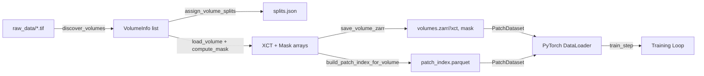
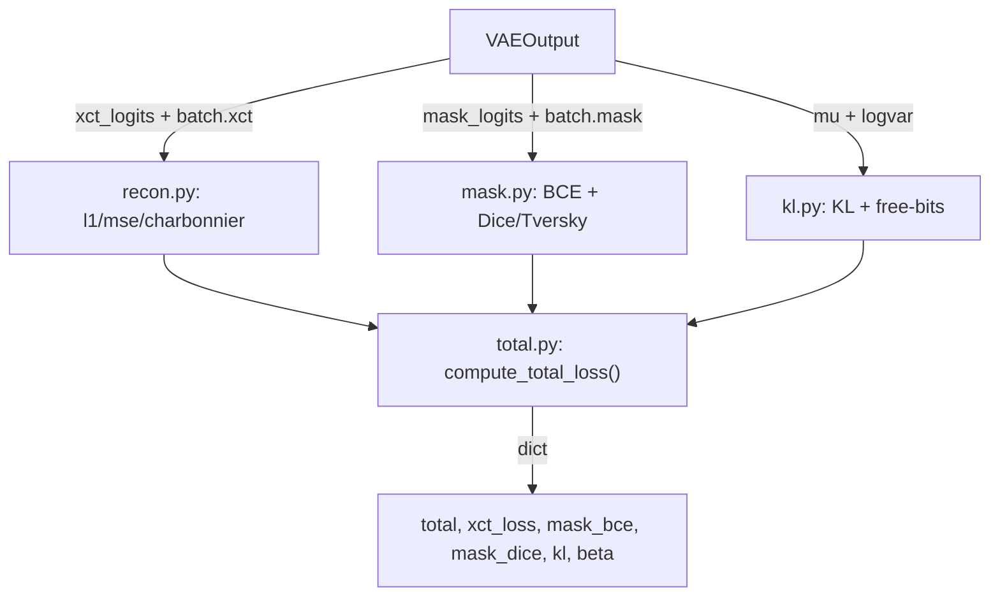
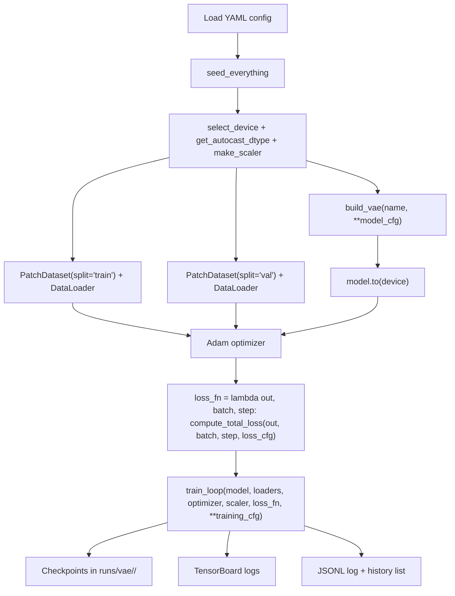
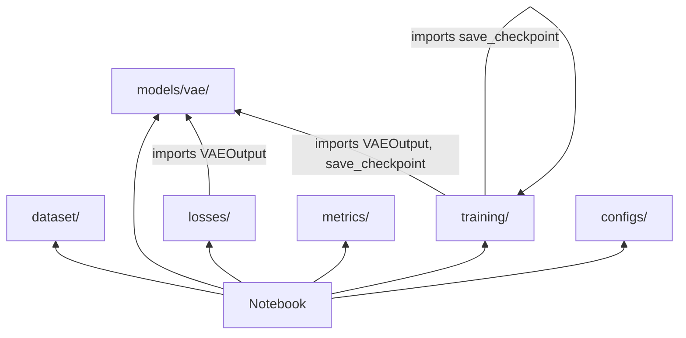

# PoreGen — Repository Structure & Component Guide

> How every piece fits together to make the training notebooks work.

---

## 1. High-Level Layout

```
GenAI/
├── pyproject.toml              # Package definition (editable install via pip -e .)
├── onlypores.py                # Standalone pore segmentation (called during dataset build)
├── src/poregen/                # The installable library — ALL logic lives here
│   ├── dataset/                # Data pipeline: raw TIFF → Zarr → Parquet → DataLoader
│   ├── models/vae/             # VAE architectures + registry
│   ├── losses/                 # Modular loss components (recon, mask, KL, total)
│   ├── metrics/                # Eval metrics (reconstruction, segmentation, latent)
│   ├── training/               # Training engine, device, checkpoint, seed
│   ├── configs/                # Default YAML configuration
│   └── vae/                    # Backward-compat re-export shim
├── notebooks/                  # Training & eval notebooks (the primary interface)
│   ├── 10_train_vae.ipynb      # Main training notebook
│   └── 11_eval_vae.ipynb       # Evaluation skeleton
├── scripts/                    # Shell helpers (dataset build, etc.)
├── tests/                      # Unit tests
├── raw_data/                   # Raw TIFF volumes (not in git)
└── data/                       # Processed dataset output (not in git)
```

The key design principle: **notebooks contain zero library logic**. They only wire together functions from `poregen.*`. All reusable code lives in the `src/poregen/` package, installed via `pip install -e ".[notebook]"`.

---

## 2. Data Flow: From Raw Volumes to Training Batches



### 2.1 Dataset Build Pipeline (`poregen.dataset`)

Triggered by the CLI command `build_dataset` or `python -m poregen.dataset.build_dataset`. Each module has a single responsibility:

| Module | Responsibility | Key Functions |
|---|---|---|
| [io.py](file:///home/jorgecabrejas/Dev/GenAI/src/poregen/dataset/io.py) | Volume discovery, TIFF loading, Zarr writing, mask computation | `discover_volumes()`, `load_volume()`, `compute_mask()`, `save_volume_zarr()` |
| [splits.py](file:///home/jorgecabrejas/Dev/GenAI/src/poregen/dataset/splits.py) | Deterministic volume-level train/val/test assignment | `assign_volume_splits()`, `save_splits()` |
| [patch_index.py](file:///home/jorgecabrejas/Dev/GenAI/src/poregen/dataset/patch_index.py) | Patch coordinate generation, integral-volume porosity | `generate_patch_coords()`, `compute_integral_volume()`, `build_patch_index_for_volume()` |
| [build_dataset.py](file:///home/jorgecabrejas/Dev/GenAI/src/poregen/dataset/build_dataset.py) | CLI pipeline orchestrating all of the above | `main()` |
| [loader.py](file:///home/jorgecabrejas/Dev/GenAI/src/poregen/dataset/loader.py) | PyTorch Dataset for training | `PatchDataset` |

**Pipeline flow in `build_dataset`:**

1. **Discover** — `discover_volumes()` recursively finds TIFFs under `raw_data/`, builds `VolumeInfo` records with stable `volume_id` strings.
2. **Split** — `assign_volume_splits()` shuffles volume IDs with a fixed seed, assigns exact counts to train/val/test. Splits are at the **volume level**, not the patch level.
3. **Process each volume:**
   - `load_volume()` reads the TIFF as uint8 `(D, H, W)`
   - `compute_mask()` calls the repo-level `onlypores.py` to generate a binary pore mask
   - `save_volume_zarr()` writes both arrays to `data/processed/volumes.zarr/<id>/` with Blosc(zstd) compression
   - `build_patch_index_for_volume()` generates all valid `(z0, y0, x0)` patch coordinates and computes per-patch porosity in O(1) via a 3D integral volume (summed-area table)
4. **Write index** — All per-volume DataFrames are concatenated into a single `patch_index.parquet`

**Output on disk:**

```
data/processed/
├── volumes.zarr/
│   └── <volume_id>/
│       ├── xct   (uint8, Blosc-compressed chunks)
│       └── mask  (uint8 {0,1})
├── patch_index.parquet    (one row per patch: volume_id, split, z0/y0/x0, ps, porosity)
└── splits.json            (volume → split mapping + seed)
```

### 2.2 Data Loading at Training Time (`PatchDataset`)

[loader.py](file:///home/jorgecabrejas/Dev/GenAI/src/poregen/dataset/loader.py) provides `PatchDataset(Dataset)`:

- Reads `patch_index.parquet`, filters to the requested split
- Lazily opens Zarr groups (cached per volume_id)
- `__getitem__` slices a `(ps, ps, ps)` patch from `xct` and `mask` arrays, normalises XCT to `[0, 1]`, and returns:

```python
{
    "xct": Tensor(1, 64, 64, 64),    # float32 [0,1]
    "mask": Tensor(1, 64, 64, 64),   # float32 {0,1}
    "volume_id": str,
    "coords": (z0, y0, x0),
    "porosity": float,
    "source_group": str,
}
```

A standard `torch.utils.data.DataLoader` wraps this for batching/shuffling.

---

## 3. Model Layer (`poregen.models.vae`)

### 3.1 Core Dataclasses ([base.py](file:///home/jorgecabrejas/Dev/GenAI/src/poregen/models/vae/base.py))

**`VAEConfig`** — shared configuration for all VAE architectures:

| Field | Default | Purpose |
|---|---|---|
| `in_channels` | 2 | XCT + mask concatenated |
| `z_channels` | 8 | Latent channel count |
| `base_channels` | 32 | First encoder stage width (doubles per stage) |
| `n_blocks` | 2 | Down/up-sampling stages → 4× spatial reduction |
| `patch_size` | 64 | Expected input size (validation only) |

Computed properties: `downsample_factor` (2^n_blocks), `latent_spatial` (patch_size / downsample_factor), `channel_schedule()` → `[32, 64]` for n_blocks=2.

**`VAEOutput`** — standardised forward-pass return:

| Field | Shape | Notes |
|---|---|---|
| `xct_logits` | `(B, 1, 64, 64, 64)` | Raw output — apply sigmoid externally |
| `mask_logits` | `(B, 1, 64, 64, 64)` | Raw output — use with BCEWithLogitsLoss |
| `mu` | `(B, 8, 16, 16, 16)` | Posterior mean |
| `logvar` | `(B, 8, 16, 16, 16)` | Posterior log-variance |
| `z` | `(B, 8, 16, 16, 16)` | Sampled latent (reparameterised) |

### 3.2 Registry ([registry.py](file:///home/jorgecabrejas/Dev/GenAI/src/poregen/models/vae/registry.py))

A simple decorator-based registry:

```python
@register_vae("conv")
class ConvVAE3D(nn.Module): ...

# Usage in notebook:
model = build_vae("conv", z_channels=8, base_channels=32)
```

`build_vae(name, **overrides)` validates overrides against `VAEConfig` fields, creates a config, and instantiates the registered class.

### 3.3 Architectures

| Model | File | Key Difference |
|---|---|---|
| **ConvVAE3D** | [conv_vae.py](file:///home/jorgecabrejas/Dev/GenAI/src/poregen/models/vae/conv_vae.py) | Baseline — stride-2 Conv3d down, ConvTranspose3d up, no skips |
| **UNetVAE3D** | [unet_vae.py](file:///home/jorgecabrejas/Dev/GenAI/src/poregen/models/vae/unet_vae.py) | Skip connections from encoder to decoder stages, sharper reconstructions |

Both use: GroupNorm, SiLU, reparameterization trick, separate 1×1 Conv3d heads for XCT and mask logits.

### 3.4 Import Chain

The `__init__.py` in [models/vae/](file:///home/jorgecabrejas/Dev/GenAI/src/poregen/models/vae/__init__.py) imports `conv_vae` and `unet_vae` to **trigger `@register_vae` decoration** at import time. Without this, `build_vae("conv")` would fail because the classes never registered themselves.

```
poregen.models.vae.__init__
  → imports conv_vae (triggers @register_vae("conv"))
  → imports unet_vae (triggers @register_vae("unet"))
  → exports: VAEConfig, VAEOutput, build_vae, register_vae
```

The top-level `poregen.vae` package is a thin re-export shim for backward compatibility.

---

## 4. Loss System (`poregen.losses`)

Losses are composable building blocks assembled by `compute_total_loss()`.



### 4.1 Component Modules

| Module | Functions | Notes |
|---|---|---|
| [recon.py](file:///home/jorgecabrejas/Dev/GenAI/src/poregen/losses/recon.py) | `l1_loss`, `mse_loss`, `charbonnier_loss`, `get_recon_loss` | All apply sigmoid internally. Selectable by name via `get_recon_loss("l1")` |
| [mask.py](file:///home/jorgecabrejas/Dev/GenAI/src/poregen/losses/mask.py) | `bce_logits_loss`, `dice_loss`, `tversky_loss`, `combined_mask_loss` | `combined_mask_loss` returns a dict with `mask_bce`, `mask_dice`/`mask_tversky`, `mask_total` |
| [kl.py](file:///home/jorgecabrejas/Dev/GenAI/src/poregen/losses/kl.py) | `kl_divergence`, `beta_schedule` | Per-channel KL with free-bits. Linear β warm-up from 0 → max_beta |
| [total.py](file:///home/jorgecabrejas/Dev/GenAI/src/poregen/losses/total.py) | `compute_total_loss` | Combines all components: `total = xct_weight × recon + mask_total + β × KL` |

### 4.2 Configuration

`compute_total_loss` uses a `cfg` dict that defaults to `_DEFAULTS`:

```python
{
    "xct_loss_type": "l1",       # l1 | mse | charbonnier
    "xct_weight": 1.0,
    "mask_bce_weight": 1.0,
    "mask_dice_weight": 1.0,
    "use_tversky": False,
    "tversky_alpha": 0.3,
    "tversky_beta": 0.7,
    "kl_free_bits": 0.25,
    "kl_warmup_steps": 5000,
    "kl_max_beta": 1.0,
}
```

In the notebook, the YAML `loss:` section overrides these defaults.

---

## 5. Metrics (`poregen.metrics`)

All metric functions use `@torch.no_grad()` and operate on logits (apply sigmoid internally where needed).

| Module | Functions | Use Case |
|---|---|---|
| [recon.py](file:///home/jorgecabrejas/Dev/GenAI/src/poregen/metrics/recon.py) | `mse`, `mae`, `psnr`, `sharpness_proxy` | XCT reconstruction quality |
| [seg.py](file:///home/jorgecabrejas/Dev/GenAI/src/poregen/metrics/seg.py) | `segmentation_metrics` | Dice, IoU, precision, recall, F1 — with `*_all` and `*_pos_only` variants |
| [latent.py](file:///home/jorgecabrejas/Dev/GenAI/src/poregen/metrics/latent.py) | `active_units`, `kl_per_channel`, `latent_stats` | Posterior health monitoring |

---

## 6. Training Infrastructure (`poregen.training`)

### 6.1 Module Responsibilities

| Module | Functions | Purpose |
|---|---|---|
| [seed.py](file:///home/jorgecabrejas/Dev/GenAI/src/poregen/training/seed.py) | `seed_everything(seed)` | Python + NumPy + PyTorch + CUDA + cuDNN deterministic |
| [device.py](file:///home/jorgecabrejas/Dev/GenAI/src/poregen/training/device.py) | `select_device(gpu_id)`, `get_autocast_dtype(device)`, `make_scaler(device)` | GPU selection, bfloat16 on Ampere+, GradScaler setup |
| [checkpoint.py](file:///home/jorgecabrejas/Dev/GenAI/src/poregen/training/checkpoint.py) | `save_checkpoint(...)`, `load_checkpoint(...)` | Atomic saves (write to `.tmp`, rename). Stores model + optimizer + scaler + scheduler + RNG states |
| [engine.py](file:///home/jorgecabrejas/Dev/GenAI/src/poregen/training/engine.py) | `train_step(...)`, `eval_step(...)`, `train_loop(...)` | Core training logic with AMP, grad clipping, TensorBoard logging, JSONL logging |

### 6.2 `train_loop` — The Core Loop

This is the function the notebook ultimately calls. It:

1. Creates an **infinite iterator** over the train DataLoader (step-based, not epoch-based)
2. For each step:
   - Calls `train_step()` → forward pass, loss, backward, optimizer step
   - Logs to JSONL file and optional TensorBoard writer
   - Every `eval_every` steps: runs `eval_step()` on a val batch
   - Every `save_every` steps: calls `save_checkpoint()`
3. Saves a final checkpoint at the end
4. Returns full history as a list of dicts for inline plotting

**`train_step` internals:**
```
model.train() → move batch to device → autocast forward → loss_fn(output, batch, step)
→ scaler.scale(loss).backward() → optional clip_grad_norm → scaler.step(optimizer)
→ optional scheduler.step() → return scalar losses
```

---

## 7. Configuration (`poregen.configs`)

[example_vae.yaml](file:///home/jorgecabrejas/Dev/GenAI/src/poregen/configs/example_vae.yaml) provides a default configuration with three sections:

| Section | Controls | Used By |
|---|---|---|
| `model:` | `name`, `z_channels`, `base_channels`, `n_blocks`, `patch_size` | `build_vae(cfg["model"]["name"], **cfg["model"])` |
| `loss:` | All `compute_total_loss` parameters | Passed as `cfg` to `compute_total_loss` |
| `training:` | `seed`, `batch_size`, `lr`, `total_steps`, `eval_every`, `save_every`, `num_workers` | Used directly in notebook to configure optimizer, DataLoader, and `train_loop` |

---

## 8. How It All Connects in the Notebook

This is the sequence of operations in `10_train_vae.ipynb`:



**Step-by-step:**

1. **Config** — Load YAML, optionally override per-experiment
2. **Reproducibility** — `seed_everything(cfg["training"]["seed"])`
3. **Device** — `select_device()` → `get_autocast_dtype()` → `make_scaler()`
4. **Data** — Create `PatchDataset` for train and val splits, wrap in `DataLoader`
5. **Model** — `build_vae("conv")` → move to device
6. **Optimizer** — `torch.optim.Adam(model.parameters(), lr=cfg["training"]["lr"])`
7. **Loss** — Wrap `compute_total_loss` as a callable that injects the loss config
8. **Train** — `train_loop()` runs the step-based loop, handles eval, checkpointing, logging
9. **Resume** — Use `load_checkpoint()` to restore model + optimizer + scaler + RNG + step counter, then pass `start_step` to `train_loop`

---

## 9. Dependency Graph Between Subpackages



- **`dataset/`** — standalone, no dependencies on other poregen subpackages
- **`models/vae/`** — standalone, defines `VAEConfig` and `VAEOutput` used by losses/training
- **`losses/`** — depends on `models.vae.base.VAEOutput` for type hints and field access
- **`metrics/`** — standalone (operates on raw tensors)
- **`training/`** — depends on `models.vae.base.VAEOutput` and its own `checkpoint` module
- **`configs/`** — just a YAML file, no code dependencies

The **notebook** is the integration point that imports from all subpackages and wires them together.

---

## 10. Key Design Decisions

| Decision | Rationale |
|---|---|
| **All heads output logits** | Sigmoid applied in loss/metric functions for numerical stability |
| **Step-based loop, not epoch-based** | Predictable runtime, meaningful checkpoints for large datasets |
| **Volume-level splits** | Prevents data leakage — patches from the same volume can't appear in both train and val |
| **Integral volume for porosity** | O(1) per-patch porosity queries instead of re-reading voxels |
| **Zarr + Parquet** | Chunked compressed storage + columnar index for fast random access |
| **Registry pattern for models** | Easy to add new architectures — just implement a class and decorate |
| **Atomic checkpoints** | Write to `.tmp` then rename — crash-safe |
| **Free-bits KL** | Prevents posterior collapse while allowing efficient latent use |
| **Notebook-first workflow** | All logic in library functions; notebooks just wire and configure |
